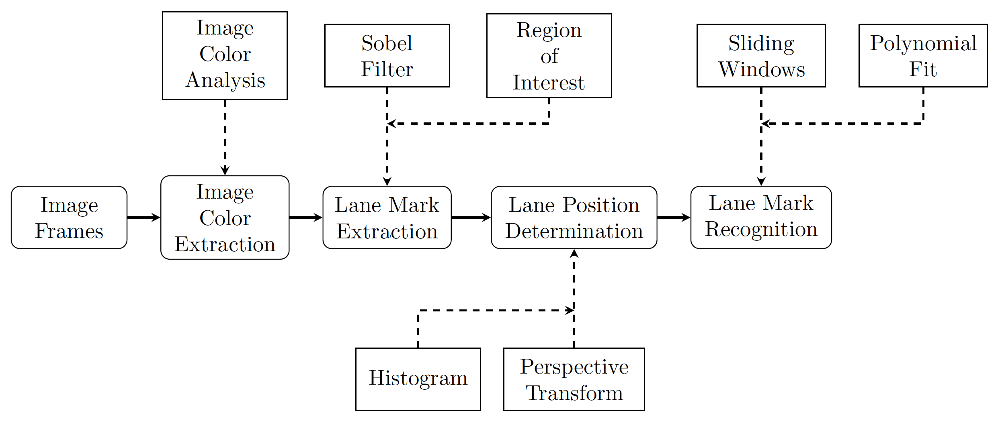
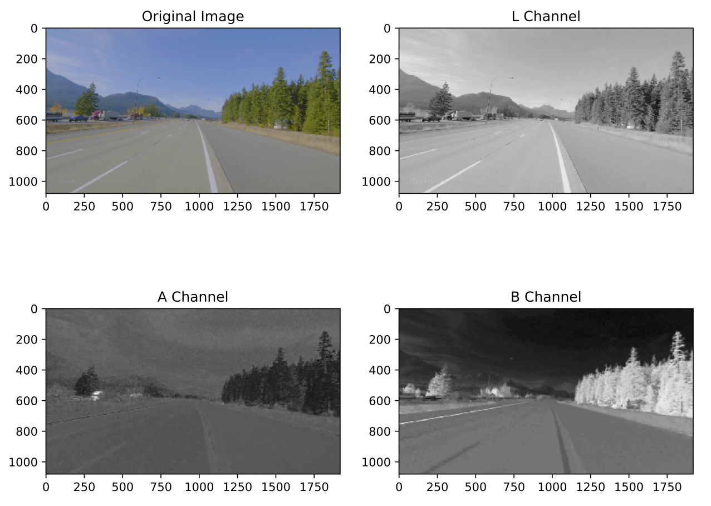
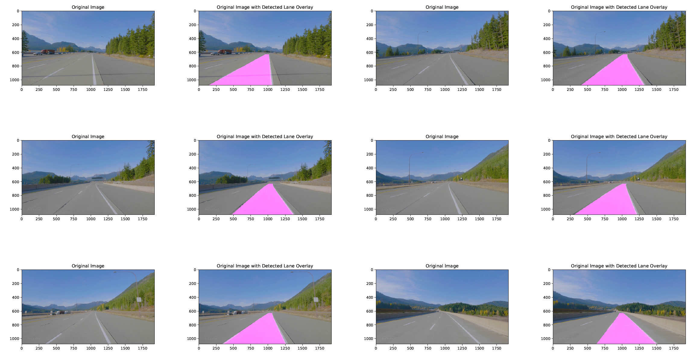


# Advanced Lane Finding Project
   Detecting and localizing lanes from a road image is an important component of intelligent transportation system applications. Intelligent vehicles are expected to be able to follow the lane direction to ensure the safety of both passengers and pedestrians.  
   The following image shows the flow diagram of the algorithm: 
    

#### OS
- The algorithm was developed under MacOS.  
- Not tested in Windows. 
#### Brief file description
All project files are under project folder, the practice fold contains practice files that may not been used in project, such as camera calibration. 
- `main.py` shows the example code for using the algorithm
- `run.py` invokes corresponding process for the input
- `processIMG.py` performs lane detection algorithm for either image sets or single image input 
- `initialize.py` generates parameters from either image sets or single image for later use in the algorithm
- `imtool.py` includes functions for filtering image, perspective transformation and histogram calculation 
- `detection.py` finds the lane marks with sliding windows method and calculates the radius of curvature. 
- `draw.py` draws detected lane mark, area or region on original image. (Visualization)

## Lane Mark Extraction 
 Given an image in RGB color space, it first converts to LAB color space. 
- Modify `imtool` to get best result for your own dataset.

It will apply Sobel Filter in both x-axis and y-axis to the L channel image, then use the combination of color and gradient thresholds to obtain a magnitude-based and direction-based binary image where the lane lines are clearly visible.

## Lane Position Determination
Pick four points in a trapezoidal shape lying along the lines that would represent a rectangle when looking down on the road from above. Apply perspective transform by using the warpPerspective function in OpenCV to generate the rectified binary image with "birds-eye view". The white pixels on the image potentially belong to the lane marks. Peak detection function takes the lower half of the warped binary image, the highest points of the accumulated values in each side are potential starting points to detect lane marks.

## Lane Mark Recognition
The sliding window detection function begins tracing lanes in the binary images with series of left and right "windows" moving upwards. The search windows start from the peaks detected in the histogram. If the pixels in a search window is beyond the threshold value, the window will be re-centered to the mean position. Since the frames are continuous, the previous lane position can be used as a reference to improve the efficiency of the sliding windows detection. After the window sliding search, a list of left and right pixel locations are collected.

Fit a quadratic equation to all the pixels by using polyfit function in NumPy. Detected lane can overlay on the original image by using the inverse matrix of the perspective transform to visualize the algorithm result. 

## Results

The run time of processing single frame is 1.24 seconds.

## Conclusion
This project covers the colour and gradient threshold, perspective transform and sliding windows to identify lane marks. The data set is chosen randomly with no camera specification. For the binary image of perspective transformation, the lane marks are not exactly parallel. Generally, we calibrate the camera before applying the algorithm. This algorithm is surprisingly robust to detect the lane marks accurately without camera parameters. 

There are many improvements could be made to this project. 
- In practice, the lane width may be changing over time where the lane marks may not appear on the bottom of the frame. 
- Auto increasing search window width may help in this situation. 
- Develop more flexible lane mark extraction method to produce better binary image under various lighting conditions. 
- Apply other relevant computer vision techniques to reinforce the algorithm when noisy in the image increases.
